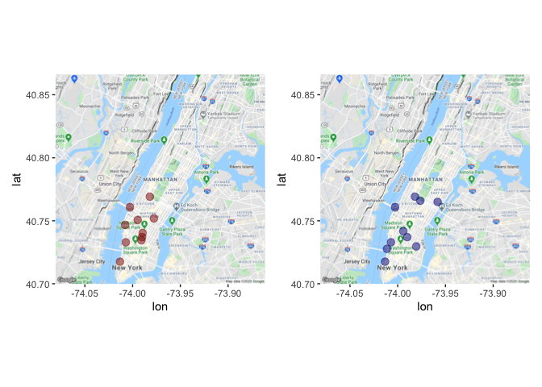
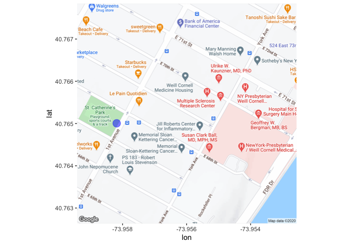

Rmarkdown citi bikes maps trials
================

Loading packages

``` r
# packages to load or download and load
pkgs = c("dplyr","ggplot2","tidyverse","readr","janitor","data.table", "patchwork") # packages names
#install.packages(pkgs) # can omit if already installed
inst = lapply(pkgs, library, character.only = TRUE) # load them
```

Pre-filtered data for March to
August

``` r
tbl_2020 <- readRDS("/Users/shlyuevd/Dropbox/WORKSHOPS/DS4A/import_citibikes/tibble_2020_test_for_map.rds")
tbl_2019 <- readRDS("/Users/shlyuevd/Dropbox/WORKSHOPS/DS4A/import_citibikes/tibble_2019_test_for_map.rds")
```

Top-10 start stations in 2019 and 2020

``` r
top2019 <- tbl_2019 %>% 
          count(start_station_name,start_station_latitude,start_station_longitude, sort=TRUE) %>%
          mutate (rank=row_number())
top2020 <- tbl_2020 %>% 
          count(start_station_name,start_station_latitude,start_station_longitude, sort=TRUE) %>%
          mutate (rank=row_number())

# joining table to get the data before and after
top_merged <- merge(top2019, top2020, by=c("start_station_name","start_station_latitude","start_station_longitude"))

top_merged[order(top_merged$rank.y),] %>% head(10)
```

    ##                start_station_name start_station_latitude
    ##  1:              12 Ave & W 40 St               40.76088
    ##  2:         West St & Chambers St               40.71755
    ##  3:               1 Ave & E 68 St               40.76501
    ##  4:            Broadway & W 60 St               40.76916
    ##  5:   Pier 40 - Hudson River Park               40.72771
    ##  6: Christopher St & Greenwich St               40.73292
    ##  7:               W 21 St & 6 Ave               40.74174
    ##  8:            E 13 St & Avenue A               40.72967
    ##  9:            E 17 St & Broadway               40.73705
    ## 10:        Central Park S & 6 Ave               40.76591
    ##     start_station_longitude   n.x rank.x   n.y rank.y
    ##  1:               -74.00278 63055      6 57924      1
    ##  2:               -74.01322 65418      4 55610      2
    ##  3:               -73.95818 35000     66 50033      3
    ##  4:               -73.98192 60260      8 46839      4
    ##  5:               -74.01130 43023     32 46503      5
    ##  6:               -74.00711 58782      9 43879      6
    ##  7:               -73.99416 55647     11 42472      7
    ##  8:               -73.98068 45643     26 39772      8
    ##  9:               -73.99009 67185      2 39486      9
    ## 10:               -73.97634 46568     23 37921     10

Loading map of NYC

``` r
library(tigris)
library(leaflet)
library(sp)
library(ggmap)
library(maptools)
library(broom)
library(httr)
library(rgdal)
register_google(key = "[your key]", write = TRUE)
```

``` r
# getting coordinates of places
#geocode("Manhattan")
nyc_map <- get_map(location = c(lon = -73.97125 , lat = 40.78306), maptype = "terrain", zoom = 12)

top2019_10 <- top_merged[order(top_merged$rank.x),] %>% head(10)
top2020_10 <- top_merged[order(top_merged$rank.y),] %>% head(10)

map2019 <- ggmap(nyc_map)+
geom_point(aes(x = start_station_longitude, y = start_station_latitude), data = top2019_10,
 alpha = .5, color="darkred", size =3)

map2020 <- ggmap(nyc_map)+
geom_point(aes(x = start_station_longitude, y = start_station_latitude), data = top2020_10,
 alpha = .5, color="darkblue", size =3)

map2019 + map2020
```

<!-- -->

Zoom on the station \#66 in 2019

``` r
# getting a zoomed  map
nyc_map_zoom <- get_map(location = c(lon = -73.956  , lat = 40.765240), zoom = 17)

ggmap(nyc_map_zoom) + 
geom_point(aes(x = start_station_longitude, y = start_station_latitude), data = top2020_10,
 alpha = .5, color="blue", size =5)
```

<!-- -->
